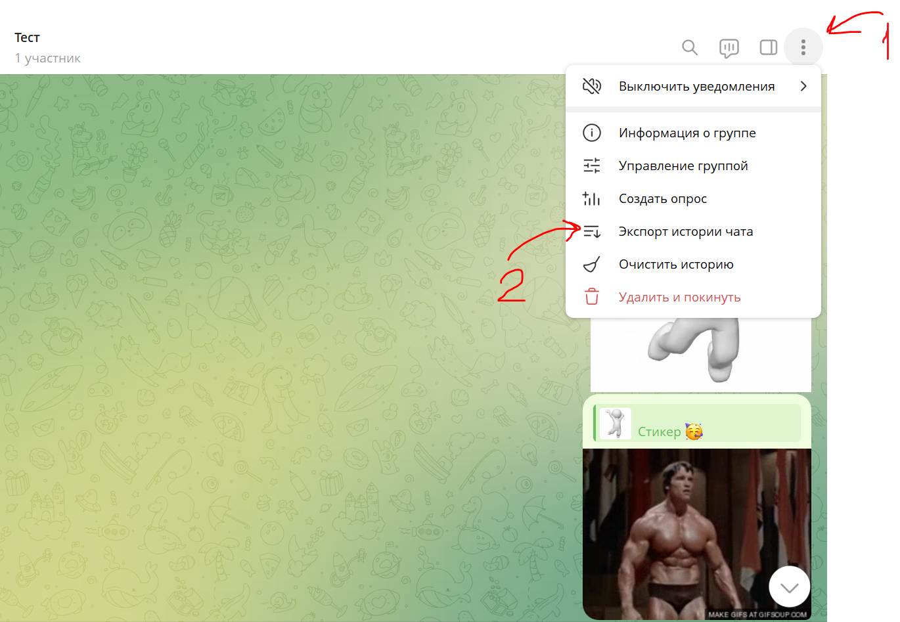
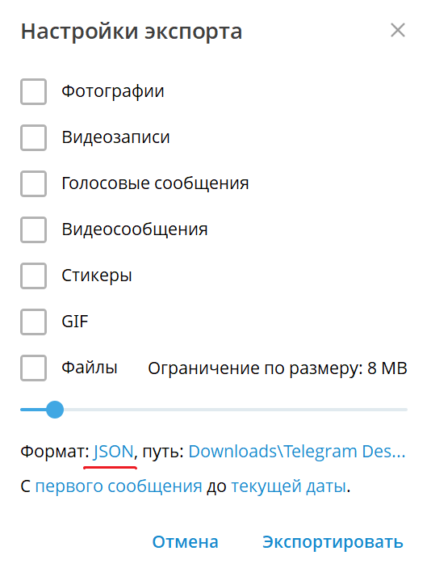
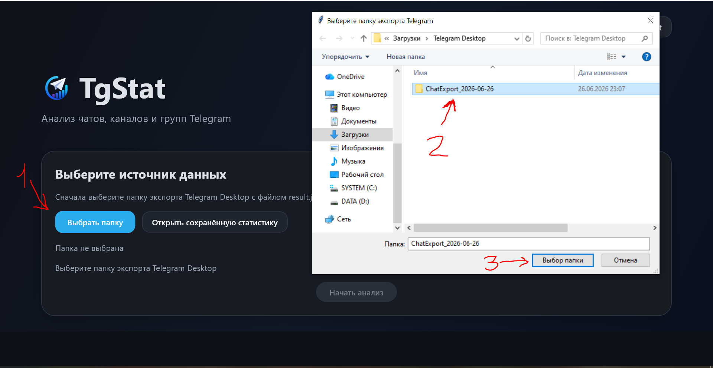

# TgStat
Приложение для анализа чатов, групп и каналов в Telegram

---

## Как пользоваться

#### 1) Установка

1. Скачиваем нужную версию

Тут будут ссылки, когда я их сделаю

2. Распаковываем

#### 2) Подготовка чатов к анализу

Для анализа чат нужно экспортировать. Для этого понадобится Telegram Desktop

1. Открываем чат ➝ ⋮ ➝ Экспорт истории чата

2. Обязательно выбираем формат "машиночитаемый json". 
Остальные настройки на ваш выбор. 
Учтите - обычно фотографии, медиа и файлы весят много, так что экспорт чата может занять очень много времени

3. Теперь, когда чат экспортирован, можно открывать приложение.
Выбираем наш экспортированный чат. После этого откроется выбор статистик

Кастомные фразы - это фразы, которые вам интересно отслеживать отдельно.
Это могут быть как простые словосочетания, так и целые предложения.
Для слов реализован отдельный поиск

4. В конце анализа будет кнопка "Сохранить".
Если вы планируете повторно смотреть статистику, вы можете сохранить её и позже открыть без повторного анализа чата 
(для чата в 200 тысяч сообщений это может сэкономить порядка 25 секунд)

---

При обнаружении ошибок, багов, опечаток и тп. пишите на почту TgStatDev@yandex.ru 

---

Приятного пользования